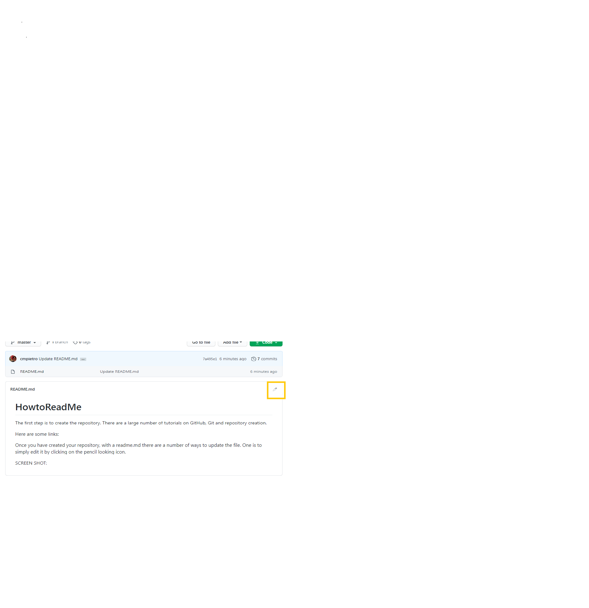

# HowtoReadMe
The first step is to **create the repository, with a readme.md**. There are a large number of tutorials on GitHub, Git and repository creation. 

Here are some links: 

* Video links to learn Git:  https://git-scm.com/videos
* A quick Git Reference link:  https://git-scm.com/docs
* A free Udemy link on your first GitHub Repository:  https://blog.udemy.com/github-tutorial-how-to-make-your-first-github-repository/
* A free playlist of YouTube Tutorials by Cory Schafer:  https://www.youtube.com/playlist?list=PL-osiE80TeTuRUfjRe54Eea17-YfnOOAx

Once you have created your repository, **with a readme.md** there are a number of ways to update the file.  One is to simply edit it by clicking on the pencil looking icon. 

**SCREEN SHOT:**  

Now that the File is open you can Edit the file using Markdown. 
GitHub has a great tutorial on markdown here: https://guides.github.com/features/mastering-markdown/

Once you have your readme created and updated the way you want, some tips to remember are: 
1. Don't forget to git pull your remote changes to your local repository. 
2. Don't forget to git add / commit / push any additional screen shots or pics that you place in your local. 
3. Keep your readme up-to-date with the latest information about any *ACTIVE* repositories.  
4. If you don't want to maintain the readme and the repository any longer, consider archiving it, or notating in the readme, that the repository is no longer active. 

**BOOTCAMP STUDENTS: **

When you create your repositories for your homework, use a new readme.md and not the readme file located in the homework folders.  The graders have the instructions for the homework already.  Provide a readme.md file with instructions for the graders on which files are your final or any special instructions.  

Topics to consider adding to your readme:
1. Title of the homework
2. Date Due or Date Completed
3. Files the user should open or review first
4. Any instructions on use? 
5. List languages / libraries or other tools used that help you stand out!
6. If a shared project, list all the users / contributors to the repository, maybe include links to their GitHub accounts. 
7. If you found a new library / piece of code or project that inspired your learning, cite in the readme what you used and include a link. 

Most of all - Have some fun!  Learn how to use the readme as a COMMUNICATION tool.  It's a part of the story you are sharing to showcase your work. 

