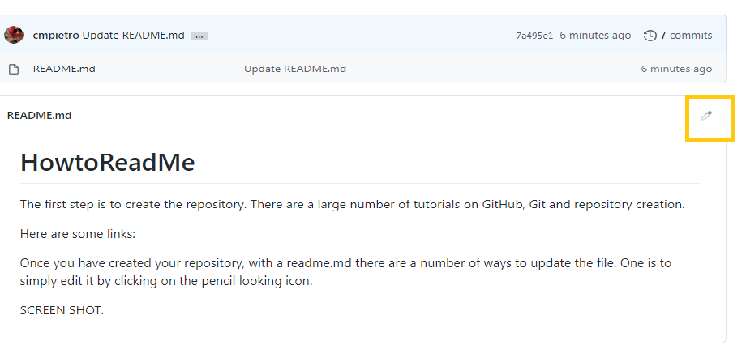

# HowtoReadMe
The first step is to create the repository. There are a large number of tutorials on GitHub, Git and repository creation. 

Here are some links: 

* Video links to learn Git:  https://git-scm.com/videos
* A quick Git Reference link:  https://git-scm.com/docs
* A free Udemy link on your first GitHub Repository:  https://blog.udemy.com/github-tutorial-how-to-make-your-first-github-repository/
* A free playlist of YouTube Tutorials by Cory Schafer:  https://www.youtube.com/playlist?list=PL-osiE80TeTuRUfjRe54Eea17-YfnOOAx

Once you have created your repository, with a readme.md there are a number of ways to update the file.  One is to simply edit it by clicking on the pencil looking icon. 

SCREEN SHOT:  

Now that the File is open you can Edit the file using Markdown. 
GitHub has a great tutorial on markdown here: https://guides.github.com/features/mastering-markdown/

